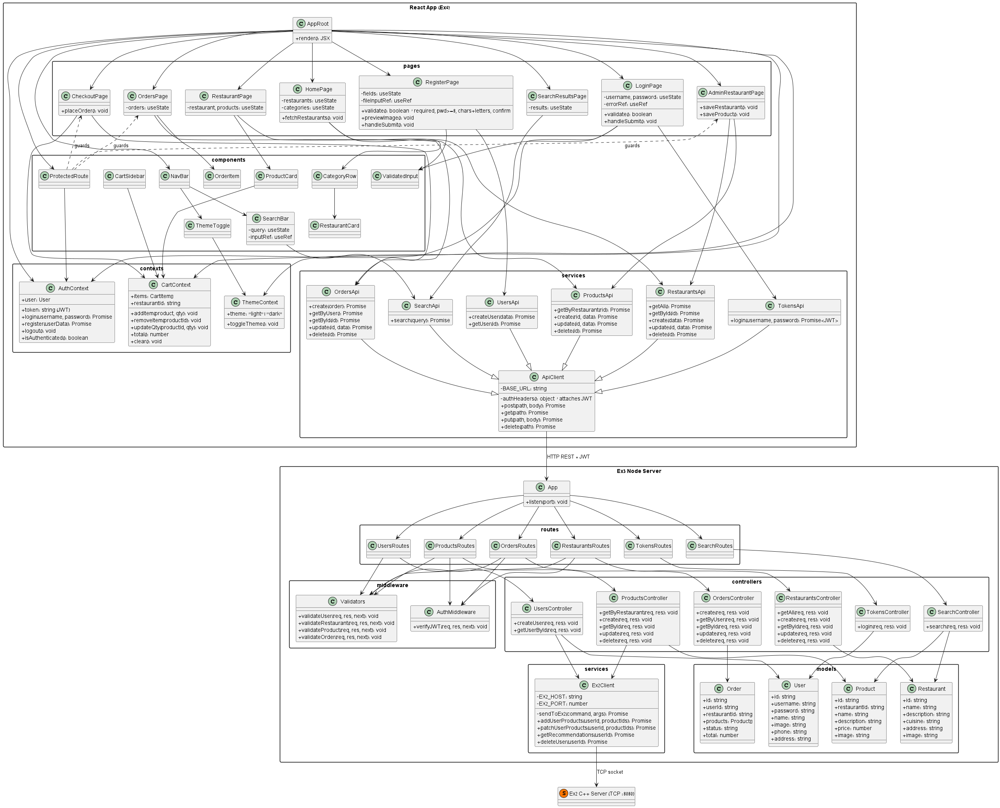
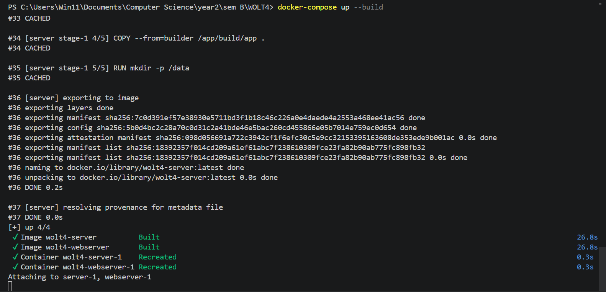
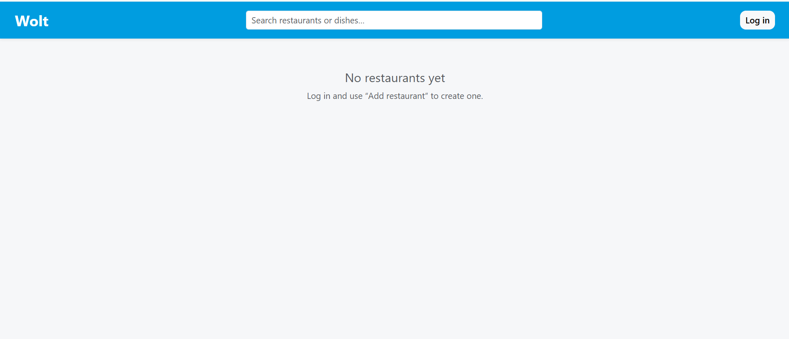

# Wolt4

A Wolt-inspired food delivery web app — React frontend, Node.js/Express backend, C++ recommendation server.



---

## Running with Docker (recommended)

Make sure Docker Desktop is running, then from the project root:

```bash
docker-compose up --build
```

This builds and starts two containers:
- **server** — C++ TCP server on port `8080` (handles recommendations)
- **webserver** — Express + React app on port `3000`

Open [http://localhost:3000](http://localhost:3000) in your browser.





To stop: `Ctrl+C`, then `docker-compose down`.

---

## Running locally (without Docker)

**Prerequisites:** Node.js 18+, a C++ build environment (cmake + g++).

**1. Build the C++ server**

```bash
cd build
cmake ..
make
./app   # listens on :8080
```

**2. Build the React client**

```bash
cd src/client
npm install
npm run build
```

Copy the output into the webserver's static folder:

```bash
cp -r src/client/build/* src/webserver/public/
```

**3. Start the Express server**

```bash
cd src/webserver
npm install
node app.js   # listens on :3000
```

Open [http://localhost:3000](http://localhost:3000).

---

## Project structure

```
src/
  server/       C++ TCP server — recommendation engine (Ex2)
  webserver/    Express API server
    app.js        entry point, serves the React build at /
    controllers/  users, tokens, restaurants, products, orders, search
    middleware/   JWT auth
    models/       in-memory stores (User, Restaurant, Product, Order)
    routes/       URL → controller mapping
    services/     ex2Client.js — TCP socket to C++ server
  client/       React application (this exercise)
    src/
      App.js        BrowserRouter + Routes (single page load, no refresh)
      contexts/     AuthContext, ThemeContext, CartContext
      pages/        Login, Register, Home, Restaurant, Search,
                    Checkout, Orders, AdminRestaurant
      components/   Navbar, CartSidebar, ProductCard, RestaurantCard,
                    SearchBar, ProtectedRoute
      services/
        api.js      all HTTP calls — automatically attaches JWT
```

---

## Using the app

**As a regular user**

1. Register at `/register` — fill in username, password (min 8 chars, must include a number), display name, and a profile picture.
2. Log in. Your name and photo appear in the top bar.
3. Browse restaurants on the home page, grouped by cuisine and city. If you entered coordinates on registration, you'll also see a "Nearby" section sorted by distance.
4. Click a restaurant to see its menu. Add items to your cart — the cart sidebar opens on the right.
5. Go to checkout and place your order.
6. View past orders under "My Orders" in the nav bar. You can cancel an order within 5 minutes of placing it. After 30 minutes the order is automatically marked as delivered. To modify individual items, call the restaurant directly using the phone number shown on the order.

**As a restaurant owner**

1. Register with the "I am a restaurant owner" checkbox checked.
2. After logging in, a "My Restaurant" button appears in the nav bar.
3. From the admin page you can create restaurants, edit their details, and manage their menus (add, edit, delete products).

**Dark / light mode**

Toggle with the button in the top-right corner of the nav bar after logging in.

---

## Notes

- All data is stored in memory and resets when the server restarts. This is intentional per the exercise spec.
- The JWT is stored in `sessionStorage` — logging out or closing the tab clears it.
- Only HTML, CSS, Bootstrap, JavaScript, and React are used on the client side, as required.
