# Auth Walkthrough ג€” Register, Login & Browse

Demonstrates the registration and login flows, and browsing restaurants, on both the **web client** and the **mobile app**.

---

## Registration

### Web

1. Open [http://localhost:3000/register](http://localhost:3000/register)
2. Fill in all required fields:
   - **Username** ג€” must be unique
   - **Password** ג€” at least 8 characters, must include at least one digit
   - **Confirm password** ג€” must match
   - **Display name**
   - **Profile picture** ג€” click to upload from your computer
   - **Latitude / Longitude** ג€” used for distance-based sorting
   - Check **"I am a restaurant owner"** if applicable
3. Field validation runs before submission ג€” invalid fields are highlighted in red with a clear message.
4. If the username is already taken, an error is shown without navigating away.
5. On success you are redirected to the home page and logged in automatically.

<!-- SCREENSHOT: web register page with all fields filled --> 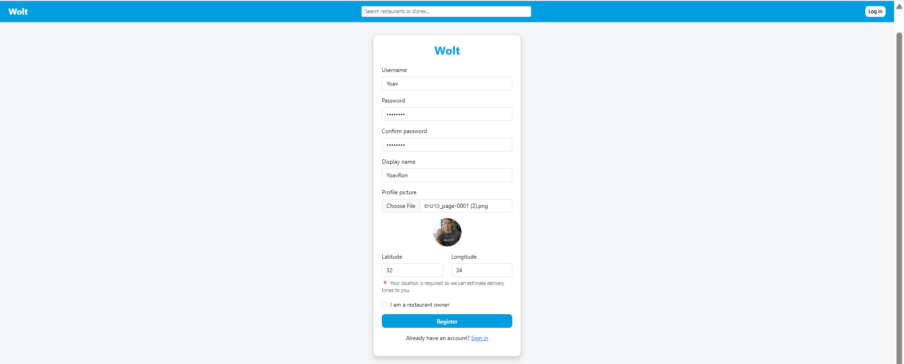
<!-- SCREENSHOT: web register page showing a validation error (e.g. short password) --> 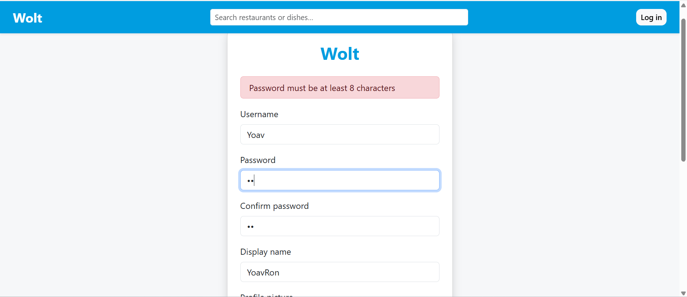
<!-- SCREENSHOT: web home page after successful registration --> 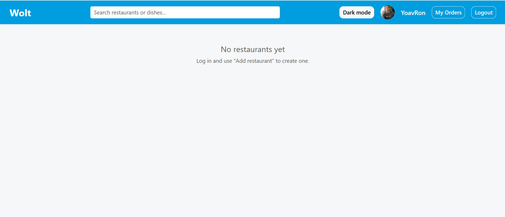

### Mobile

1. Open the app ג€” the login screen is shown.
2. Tap **Register**.
3. Fill in the same fields. Tap the profile picture area to choose from gallery or camera.
4. Validation messages appear inline below each field before you submit.
5. On success you land on the home screen.

<!-- SCREENSHOT: mobile register screen --> 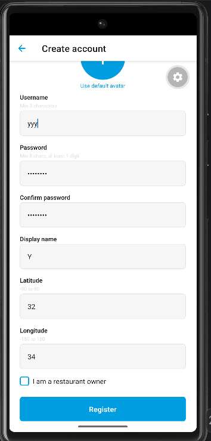
<!-- SCREENSHOT: mobile register screen showing validation hints --> 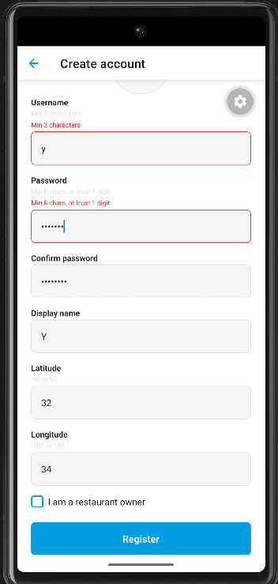
<!-- SCREENSHOT: mobile home screen after registration --> 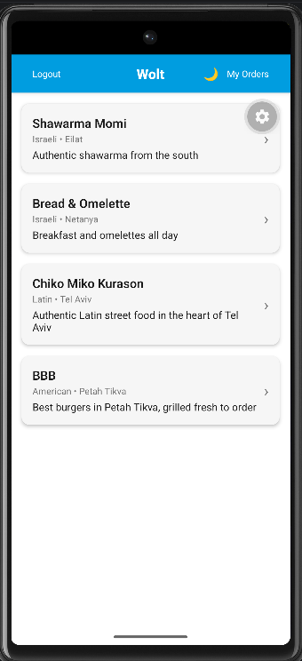

---

## Login

### Web

1. Go to [http://localhost:3000](http://localhost:3000)
2. Enter username and password.
3. Wrong credentials ג†’ a clear error message is shown, you stay on the login page.
4. Correct credentials ג†’ redirected to the home page.

<!-- SCREENSHOT: web login page --> 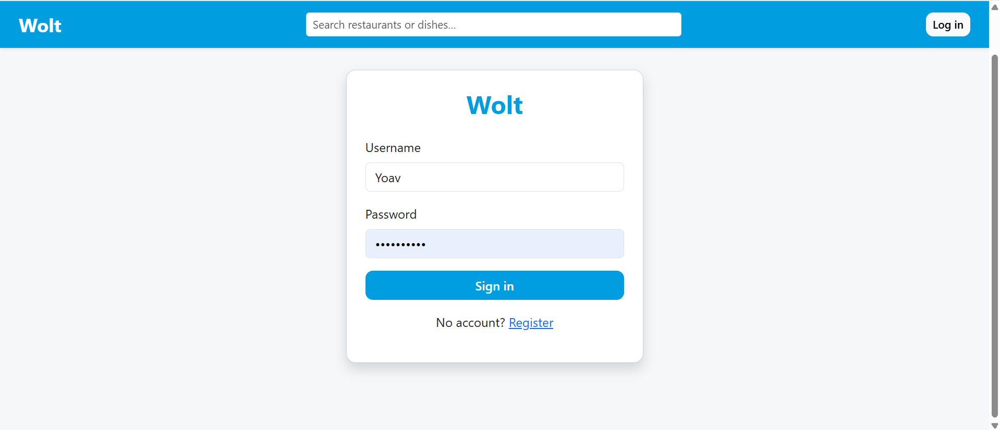
<!-- SCREENSHOT: web login page with wrong-credentials error --> 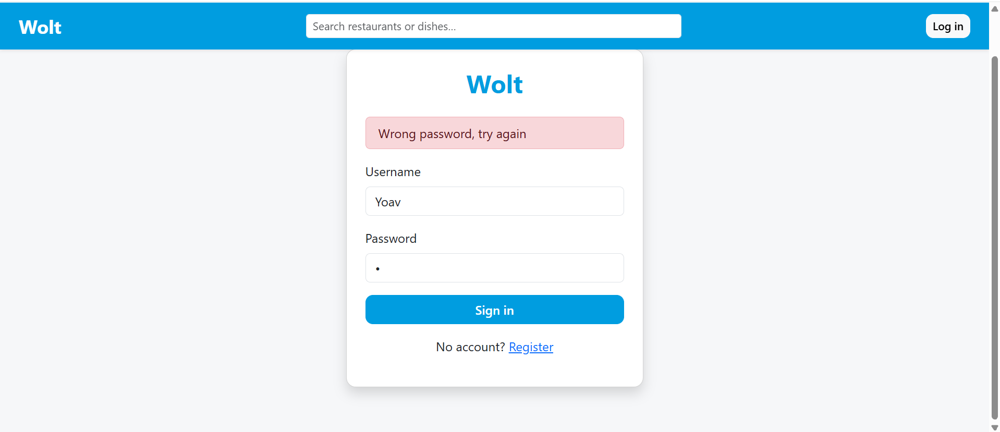
<!-- SCREENSHOT: web home page after login, showing user info in the navbar --> 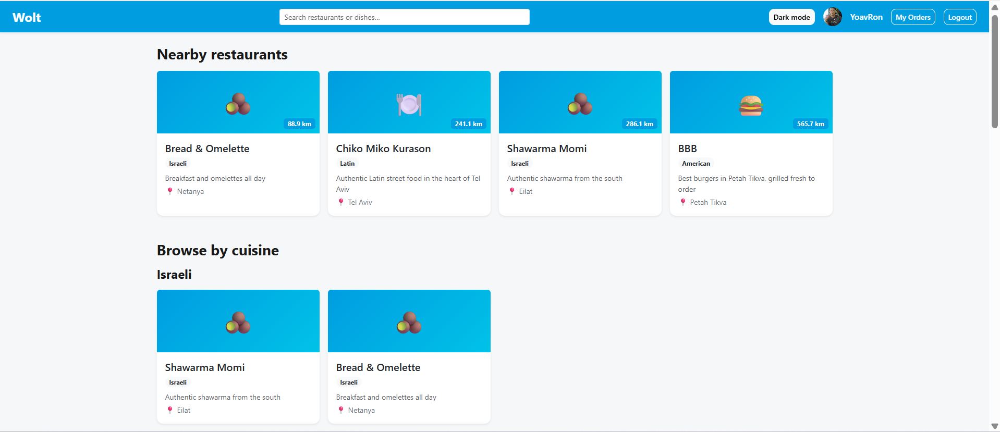

### Mobile

1. Enter username and password on the login screen.
2. Wrong credentials ג†’ error shown below the button.
3. Correct credentials ג†’ navigate to the home screen.

<!-- SCREENSHOT: mobile login screen --> 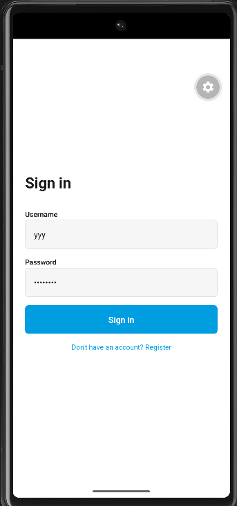
<!-- SCREENSHOT: mobile login with error message --> 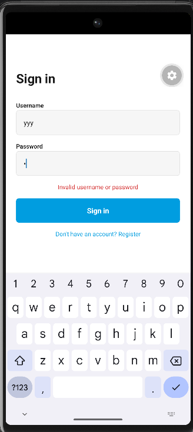

---

## Browsing restaurants

### Web

1. The home page shows all restaurants as cards (image, name, cuisine, address).
2. A search bar at the top filters across restaurant names and dish names.
3. Clicking a restaurant card opens its detail page with the full menu.

<!-- SCREENSHOT: web home page with restaurant list --> 
<!-- SCREENSHOT: web restaurant detail page with menu items --> 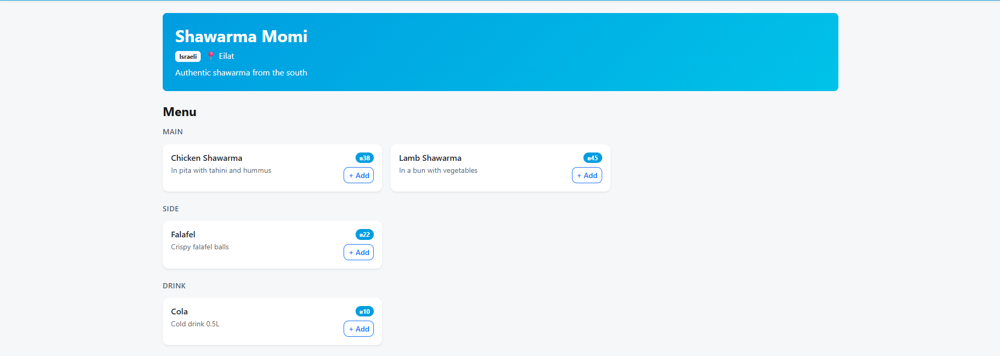

### Mobile

1. The home screen shows a scrollable list of restaurant cards.
2. Pull to refresh to reload the list.
3. Tap a card to open the restaurant detail screen with products.

<!-- SCREENSHOT: mobile home screen with restaurant cards --> 
<!-- SCREENSHOT: mobile restaurant detail screen --> 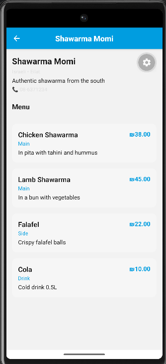

---

## Logout

### Web

Click **Logout** in the navbar. Session is cleared and you are returned to the login page.

<!-- SCREENSHOT: web navbar with logout button --> 

### Mobile

Open the side drawer (tap the menu icon) and tap **Logout**. Token is cleared, app returns to the login screen.

<!-- SCREENSHOT: mobile drawer open with logout option -->
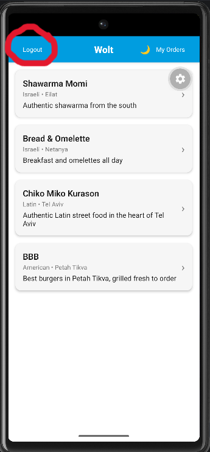