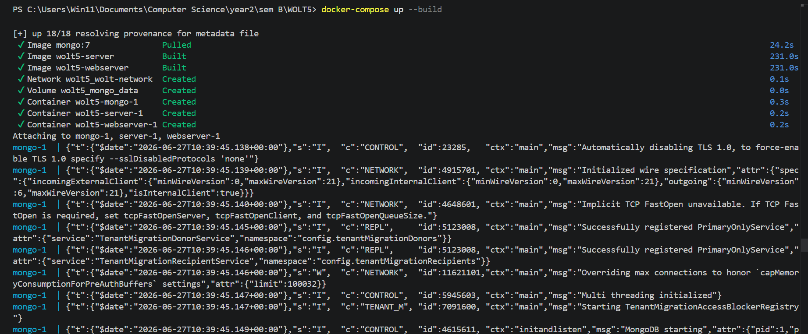
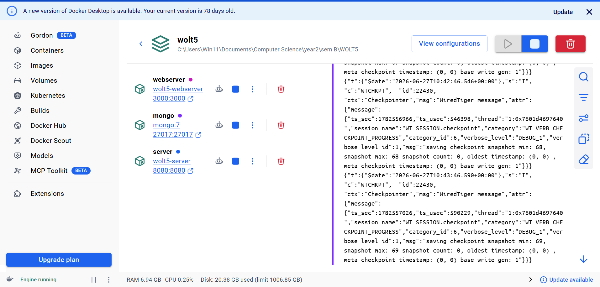

# Environment Setup

How to bring up the full Wolt5 stack from scratch.

---

## Prerequisites

| Tool | Version | Purpose |
|------|---------|---------|
| Docker Desktop | Latest | Runs all backend containers |
| Node.js | 18+ | Running the mobile app locally |
| Expo Go | Latest | Running the RN app on a phone |
| Android emulator (optional) | — | Alternative to a physical device |

---

## Step 1 — Clone the repository

```bash
git clone https://github.com/LeoTesslerShar/WOLT5.git
cd WOLT5
```

---

## Step 2 — Start Docker Desktop

Make sure Docker Desktop is running before continuing.

> **Windows:** look for the Docker whale icon in the system tray.

---

## Step 3 — Build and start all backend containers

From the project root:

```bash
docker-compose up --build
```

This single command:
1. Pulls the `mongo:7` image and starts MongoDB on port `27017`
2. Compiles the C++ recommendation server and starts it on port `8080`
3. Builds the React web client, bundles it into the Express server, and starts it on port `3000`

The webserver waits for MongoDB to be ready before accepting connections.



Expected output — all three services should show as running:

```
[+] Running 3/3
 ✔ Container wolt5-mongo-1      Started
 ✔ Container wolt5-server-1     Started
 ✔ Container wolt5-webserver-1  Started
```



---

## Step 4 — Verify the web client

Open [http://localhost:3000](http://localhost:3000) in your browser.  
You should see the Wolt login page.

<!-- SCREENSHOT: browser showing the login page at localhost:3000 -->

---

## Step 5 — Start the mobile app

In a new terminal:

```bash
cd src/mobile
npm install
npx expo start
```

<!-- SCREENSHOT: terminal showing Expo QR code and dev server output -->

Scan the QR code with **Expo Go** on your phone, or press `a` to launch the Android emulator.

<!-- SCREENSHOT: mobile app login screen on device/emulator -->

---

## Stopping the environment

```bash
# Stop all containers (data is preserved in the mongo_data volume)
docker-compose down

# Stop AND wipe the database
docker-compose down -v
```

---

## Architecture overview

```
┌─────────────────────────────────────────────┐
│              Docker Compose                 │
│                                             │
│  ┌──────────┐    ┌──────────────────────┐   │
│  │  mongo   │◄───│     webserver        │   │
│  │ :27017   │    │  Express + React SPA │   │
│  └──────────┘    │       :3000          │   │
│                  └──────────┬───────────┘   │
│  ┌──────────┐               │ TCP           │
│  │  server  │◄──────────────┘               │
│  │  C++ :8080│                              │
│  └──────────┘                               │
└─────────────────────────────────────────────┘
         ▲                        ▲
         │ HTTP REST              │ HTTP REST
  ┌──────────────┐       ┌───────────────────┐
  │  React Web   │       │  React Native App │
  │  (browser)   │       │  (Expo / device)  │
  └──────────────┘       └───────────────────┘
```